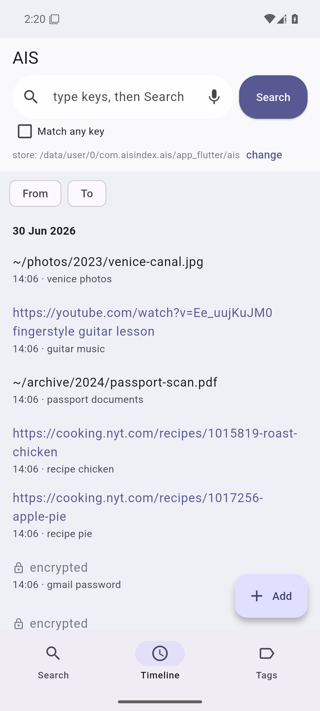
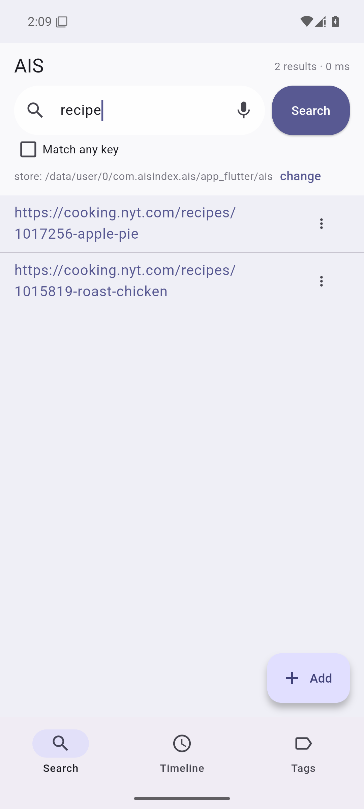
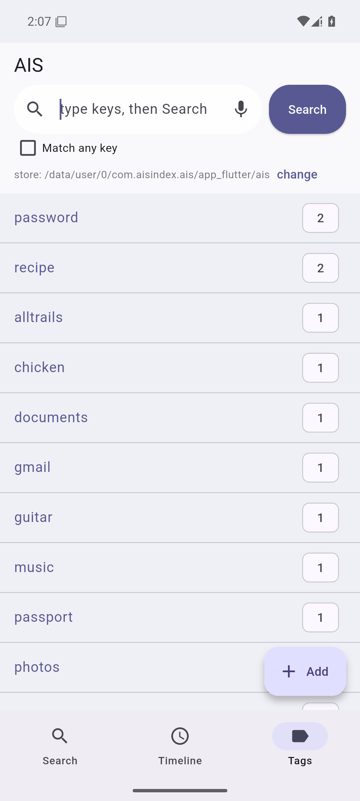
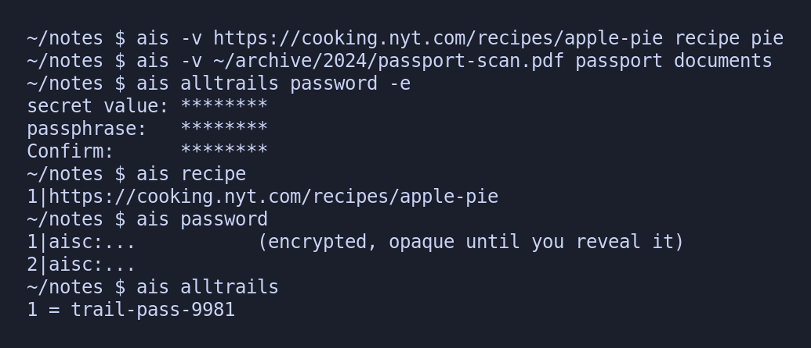

# AIS: Associative Indexing Service

**Your memory, yours to keep.**\
*Models average everyone. Keep what's only yours.*

An extension of your associative memory: a memo that is always with you and always yours, that brings things back the way your mind does, by association. Underneath, an index: file anything under keys, recall it by keys, plain text on your own disk.

<p align="center">
  
  
  
</p>
<p align="center"><em>The phone app: file links, file paths and notes, recall them by tag; passwords stay encrypted (&#128274;). The same index from the command line:</em></p>
<p align="center">
  
</p>

## Download

The latest stable build for every platform. The link below always points at the current release, never an old one:

> **<https://github.com/Anode1/ais/releases/latest>**

- **Windows**: unzip `…-windows-x86_64.zip` and double-click **`ais-gui.exe`** (the native desktop app). Nothing is installed; to remove it, delete the folder. Prefer a Start-Menu entry? Run `…-installer.exe` instead (per-user, no admin).
- **macOS / Linux**: unzip the `…-<os>-<arch>.zip`, then `./ais --serve` opens the GUI in your browser (or use the `ais` CLI; add it to your PATH to use it anywhere).

The binaries are not code-signed, so the first run is flagged as an unrecognized download (Windows SmartScreen "unknown publisher"; macOS Gatekeeper "could not verify"). That is a new-and-unsigned notice, not a malware finding. On Windows click **More info ▸ Run anyway** (once per file); on macOS run `xattr -dr com.apple.quarantine .` in the unzipped folder. A copy you build yourself is never flagged.

## Verify a download

Each release file ships beside a matching `…zip.sha256`. Download both, then check the hash (prints `OK` on a match):

```sh
shasum -a 256 -c ais-*-*.zip.sha256          # macOS / Linux
```
```powershell
Get-FileHash ais-*-windows-x86_64.zip -Algorithm SHA256   # Windows, compare against the .sha256
```

Releases are built in the open by GitHub Actions (`.github/workflows/release.yml`), not on anyone's machine.

## Quick start (from source)

```sh
make                 # build ./ais
./ais --init           # create an index here (a .ais/ directory, git-style)
./ais --serve          # open the web GUI in your browser
```

`ais --help` lists every command; [`doc/USING.txt`](doc/USING.txt) has the everyday CLI cheat-sheet (recall, add, edit) and where your data lives.

**Tip:** `alias is='ais'` gives you two-character recall: `is venice italy` reads like the question it answers.

## Why

A model trained on everyone gives you the average; your prior (your own associations and ordering) is the systematic lens the average cancels out. AIS keeps that unaveraged, as plain text you control, never taking your files hostage: it stores only a reference, so the index is a view and your data is never touched. See [`about.txt`](doc/about.txt) for the pitch and the memex origin, and [`foundation.md`](doc/foundation.md) for the prior/compression argument behind it.

## Questions

**Why not SQLite, or a database?**
A database is the right tool for an *app*; this is for a *person*. SQLite is a binary file one program understands; AIS is line-oriented plain text you can read, grep, diff, and recover by hand. You trade query power you do not need for the durability and transparency of plain text (see [`about.txt`](doc/about.txt)).

**Why not an embedded engine (BerkeleyDB, LMDB, gdbm)?**
Because a bundled engine is a dependency you do not control. An early AIS version actually ran on BerkeleyDB (both the Java and the C editions) right as it was acquired and relicensed; this plain-text design is that lesson, learned firsthand. A format only one library version can open is a bet that the library, its license, and its on-disk layout outlive your data; they rarely do. AIS has no engine to depend on: any future AIS, any unix tool, or any format you migrate to can read the store.

**Is keys-only search not limiting?**
On purpose. The keys you assign *are* the point: they are your prior, your ordering of the world. Full-text search finds words; keys find the meaning you committed to. (`ais --find` still searches values and paths.) To search a document's contents, keep it as a file and index its path.

**Is the built-in web server not a toy?**
It is deliberately minimal and not the main interface. The CLI is the contract; `ais --serve` is one thin wrapper over it, a single-user loop that binds 127.0.0.1 only. The native Win32 app and the Flutter mobile app are other wrappers; the engine depends on none of them. See [`OVERVIEW.md`](doc/OVERVIEW.md) for the full front-end map.

**Is this not just a bookmark manager / recoll / org-mode?**
It overlaps all three and copies none. Not a bookmark manager: it files *anything* under *any* keys, not URLs in a browser. Not full-text (recoll): it indexes the keys you choose, not document bodies. Not org-mode: no single tree, no app lock-in, no markup to learn, just keys with set algebra (AND / OR) over plain files. The distinctive part is that the index *is your bias*, kept unaveraged and portable.

**Can it hold passwords? Is it a password manager?**
It stores a secret encrypted inline (`-e`), but it is not a manager for hundreds of web logins: no autofill, no generation, no shared vaults; for those, a dedicated manager is more convenient. Where it wins is *agent safety*. Decryption is interactive (a passphrase you supply at a terminal or in the app), so an agent reading your index sees an opaque `aisc:` marker, not the secret, with no master key and no unlocked vault to drain. For the secret that belongs next to its context, that is safer to put in front of an agent than wiring a whole vault to one. See [`about.txt`](doc/about.txt).

## Learn more

| Read | For |
|------|-----|
| [`doc/USING.txt`](doc/USING.txt) | How to use it, GUI on every OS (plain steps, no jargon). |
| [`doc/about.txt`](doc/about.txt) | What AIS is, and what it is not. |
| [`doc/OVERVIEW.md`](doc/OVERVIEW.md) | Design philosophy, status, provenance. |
| [`doc/ROADMAP.md`](doc/ROADMAP.md) | What's planned, and where to help. |
| [`doc/dev/LAYOUT.md`](doc/dev/LAYOUT.md) | On-disk format and module map. |
| `man ais` | Full command reference. |

## License

New code (`c/`): GNU GPL v2 or later (per source headers). Legacy material (`legacy/`) under its original Apache License 2.0. Author: Vasili Gavrilov (GitHub [Anode1](https://github.com/Anode1)).
