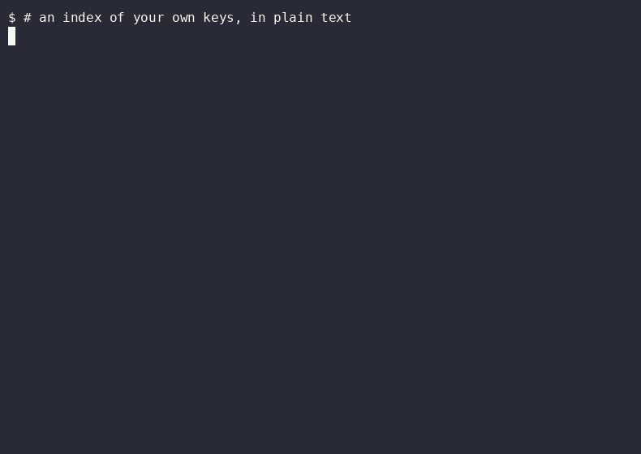
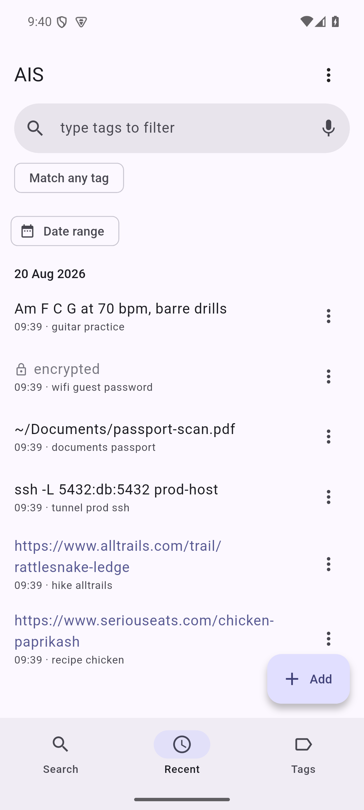
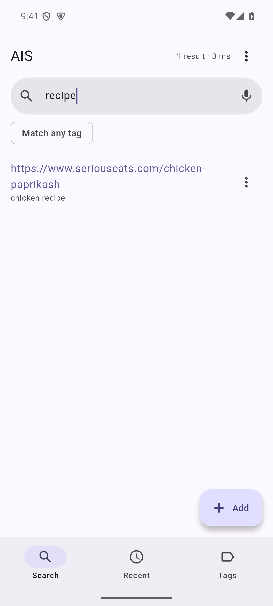
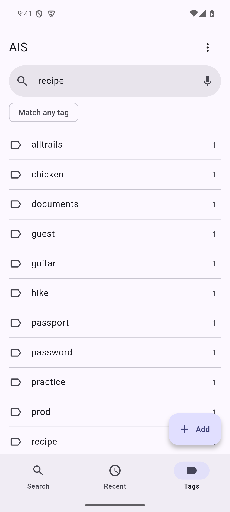
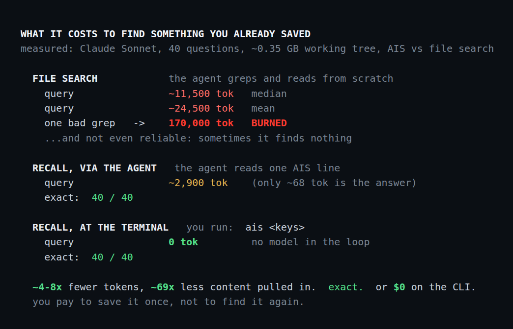

# ais

**Save anything under your own keys, recall it by those keys.**

A command-line program over an index in plain text on your own disk. You save anything (a link, a file, a note, a password) under one or more keys, and recall it by those keys: `ais venice italy` gives back what you saved under both, the way your mind does, by association. It stores only a reference, so your documents stay where you keep them; the index is a view, and your data is never touched. Not a search engine over everyone's web, and not a tagger that guesses: an index of your own things under your own words. Why that matters is [below](#why).

One engine, thin front-ends. The CLI is the contract; the web GUI (`ais --serve`), the Flutter mobile app and a native Win32 wrapper sit over it, and the engine depends on none of them. C, no database, no runtime to install.

It also saves tokens, which is not obvious: this is not an AI product, but if you work with a coding agent, letting it recall from your index costs a fraction of letting it grep and read your tree again. Measured: four times fewer tokens at the median, 69x less content pulled into the context window, and every answer exact. [The numbers are below](#for-coding-agents-recall-instead-of-searching-again).

Because it is plain text, it outlives its own tools: your index survives decades of archiving, still opens in fifty years, and exports into anything, no lock-in. Keeping data readable that long is computing's unsolved *digital dark age*, where file formats and the apps that open them die faster than the data. Plain text, readable since the 1960s on any machine with no special program, is the oldest and safest answer.

<p align="center">
  
</p>
<p align="center"><em>Save a path, the ssh tunnel you always look up, a link: each under the words you would think of later. Then ask by those words. The same index on the phone:</em></p>
<p align="center">
  
  
  
</p>
<p align="center"><em>Save links, file paths and notes, recall them by tag; passwords stay encrypted (&#128274;).</em></p>

## Download

The latest stable build for every platform. The link below always points at the current release, never an old one:

> **<https://github.com/Anode1/ais/releases/latest>**

- **Android**: install `ais-<tag>-android.apk` from the release page (you will have to allow installing from your browser, once). `…-android.aab` beside it is the Play Store upload format — it is not installable by hand, so take the `.apk`.
- **macOS / Linux**: unzip the `…-<os>-<arch>.zip`, then `./ais --serve` opens the GUI in your browser (or use the `ais` CLI; add it to your PATH to use it anywhere).
- **Windows**: _no Windows build is published at the moment_ while the desktop GUI is reworked, so there is nothing to download on that line yet. Build from source (below), or run the Android app, or reach a machine on your LAN that is running `ais --serve`.

The desktop binaries are not code-signed, so the first run is flagged as an unrecognized download (macOS Gatekeeper "could not verify"). That is a new-and-unsigned notice, not a malware finding: on macOS run `xattr -dr com.apple.quarantine .` in the unzipped folder. A copy you build yourself is never flagged. The Android package **is** signed, with the project's own upload key.

## Verify a download

Each release file ships beside a matching `…zip.sha256`. Download both, then check the hash (prints `OK` on a match):

```sh
shasum -a 256 -c ais-*-*.zip.sha256          # macOS / Linux
```

Releases are built in the open by GitHub Actions (`.github/workflows/release.yml`), not on anyone's machine.

## Quick start (from source)

```sh
make                 # build ./ais
./ais --init           # create an index here (a .ais/ directory, git-style)
./ais --serve          # open the web GUI in your browser
```

`ais --help` lists every command; [`doc/USING.txt`](doc/USING.txt) has the everyday CLI cheat-sheet (recall, add, edit) and where your data lives.

**Tip:** `alias is='ais'` gives you two-character recall: `is venice italy` reads like the question it answers.

## Why

**Your memory, yours to keep.**

A search engine and an automatic tagger both answer with the *mean*: what these words mean to most people, what the model saw most often. That is the right answer when you are looking for something everyone knows, and the wrong one when you are looking for something only you saved.

Your keys are the deviation from that mean. "venice" is a week in 2023 for one person, a glass factory for another, a chapter of a thesis for a third. Nothing but you records which one it is, and no amount of training data recovers it, because averaging is precisely what removes it.

So ais does not guess and does not tag for you. It saves what you give it under the words you chose, and hands it back when you say them again. That is the whole trade: you do the small work of naming a thing once, and in exchange the index is yours rather than an average of everyone's, in plain text you control, never taking your files hostage.

See [`about.txt`](doc/about.txt) for the pitch and the memex origin, and [`foundation.md`](doc/foundation.md) for the prior/compression argument behind it.

## Questions

**Why not SQLite, or a database?**
A database is the right tool for an *app*; this is for a *person*. SQLite is a binary file one program understands; ais is line-oriented plain text you can read, grep, diff, and recover by hand. You trade query power you do not need for the durability and transparency of plain text (see [`about.txt`](doc/about.txt)).

**Why not an embedded engine (BerkeleyDB, LMDB, gdbm)?**
Because a bundled engine is a dependency you do not control. An early ais version actually ran on BerkeleyDB (both the Java and the C editions) right as it was acquired and relicensed; this plain-text design is that lesson, learned firsthand. A format only one library version can open is a bet that the library, its license, and its on-disk layout outlive your data; they rarely do. ais has no engine to depend on: any future ais, any unix tool, or any format you migrate to can read the store.

**Is keys-only search not limiting?**
On purpose. The keys you assign *are* the point: they are your prior, your ordering of the world. Full-text search finds words; keys find the meaning you committed to. (`ais --find` still searches values and paths.) To search a document's contents, keep it as a file and index its path.

**Is the built-in web server not a toy?**
It is deliberately minimal and not the main interface. `ais --serve` is one thin wrapper over the CLI, a single-user loop that binds 127.0.0.1 only. The native Win32 app and the Flutter mobile app are other wrappers; the engine depends on none of them. The full front-end map is in [`dev/DISTRIBUTION.md`](doc/dev/DISTRIBUTION.md).

**Is this not just a bookmark manager / recoll / org-mode?**
It overlaps all three and copies none. Not a bookmark manager: it saves *anything* under *any* keys, not URLs in a browser. Not full-text (recoll): it indexes the keys you choose, not document bodies. Not org-mode: no single tree, no app lock-in, no markup to learn, just keys with set algebra (AND / OR) over plain files. The distinctive part is that the index *is your bias*, kept unaveraged and portable.

**Does it replace my photo library or files?**
No, it points *into* them. For files, photos and pages ais is an index of pointers, not a store of copies: a photo stays in Immich, a file on disk, a page at its URL. You save the *reference* under your own keys and recall it by association; the silo keeps the bytes. It does not compete with Immich or the filesystem, it sits across them as the one associative layer that remembers where a thing is and why it mattered. (Secrets are the one exception: those it stores inline, encrypted, see below.)

**Can it hold passwords? Is it a password manager?**
Yes. A secret is stored encrypted inline (`-e`), so a login lives right next to the context it belongs to, and two things set it apart from a built-in manager. It is **cross-platform**: Apple Keychain and Google Password Manager are locked to one ecosystem, while ais is the same plain-text index on Windows, macOS, Linux, Android and the CLI, so your secrets travel with you. And it is **agent-safe**: decryption is interactive (a passphrase you supply at a terminal or in the app), so an agent reading your index sees an opaque `aisc:` marker, not the secret, with no master key or unlocked vault to drain. What it is *not* is a bulk web-login manager: no autofill, no generation, no shared vaults, so for hundreds of site logins a dedicated cross-platform manager is still more convenient. See [`about.txt`](doc/about.txt).

## Learn more

| Read | For |
|------|-----|
| [`doc/USING.txt`](doc/USING.txt) | How to use it, GUI on every OS (plain steps, no jargon). |
| [`doc/about.txt`](doc/about.txt) | What ais is, and what it is not. |
| [`doc/command_line.txt`](doc/command_line.txt) | Every command and option, the full `ais --help`. |
| [`doc/SYNC.md`](doc/SYNC.md) | Sync your index between devices: encrypted LAN sync (`--sync`), or through a shared folder a tool like Syncthing keeps in sync (`--sync-folder`). |
| [`doc/OVERVIEW.md`](doc/OVERVIEW.md) | Why it is built this way, and where it came from. |
| [`doc/ROADMAP.md`](doc/ROADMAP.md) | What's planned, and where to help. |
| [`doc/dev/LAYOUT.md`](doc/dev/LAYOUT.md) | On-disk format and module map. |
| [`doc/dev/PROSE.md`](doc/dev/PROSE.md) | How these documents are written. |
| `man ais` | Full command reference. |

## For coding agents: recall instead of searching again

An agent that greps and reads to find something you already saved pays that cost on every question. Recall by key costs one line, and it is exact: a wrong key returns nothing rather than something plausible.

The measurement: eight questions, five repeats each, one agent run both ways over the same corpus.

<p align="center">
  
</p>

| | file search (grep + read) | recall by key |
|---|---|---|
| tokens per question, mean | 24,500 | 2,900 |
| of that, the retrieval payload | 4,744 | **68** |
| answered correctly | 31 of 40 | **40 of 40** |

Four times fewer tokens at the median and nine at the mean, and 69x less content dragged into the context window. Run `ais` yourself at the terminal and the cost is zero, because no model is involved.

The harness is in [`experiment/`](experiment/), and the deposited run reproduces with no API key:

```sh
cd experiment && python3 analyze.py --csv results_repeats_sanitized.csv
```

The skill itself is [`.claude/skills/ais/SKILL.md`](.claude/skills/ais/SKILL.md). Copy it into your own project's `.claude/skills/` to give your agent the same. The argument behind the numbers is in [`foundation.md`](doc/foundation.md).

## See also

[agent-recipes](https://github.com/Anode1/agent-recipes) - short prompts for working with coding agents; ais is one of them (store and recall procedures instead of re-deriving them).

## License

New code (`c/`): GNU GPL v2 or later (per source headers). Legacy material (`legacy/`) under its original Apache License 2.0. Author: Vasili Gavrilov (GitHub [Anode1](https://github.com/Anode1)).
