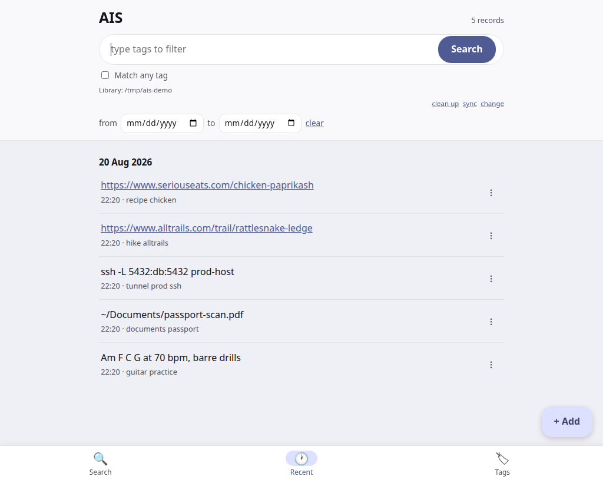
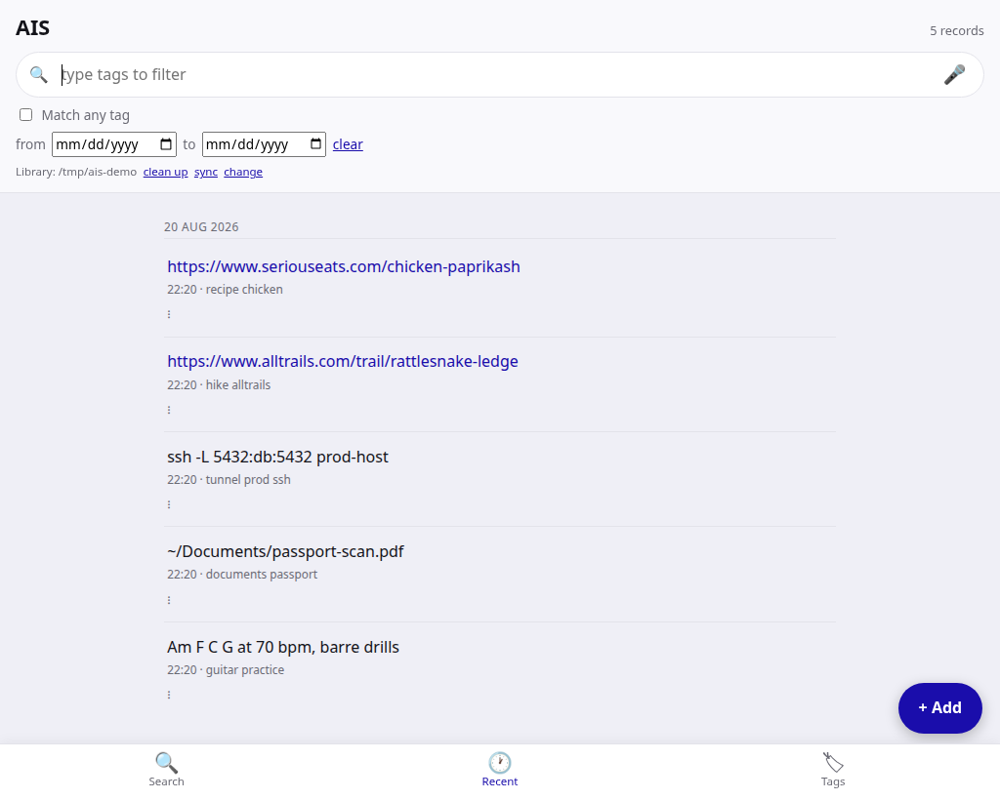

# GUI conventions (web, Flutter, native desktop)

> This file is what the surfaces must LOOK like. How to drive and test them
> without a human clicking -- headless browser, Flutter by deep link and
> keyboard, a real APK on an emulator -- is `doc/dev/GUI_TESTING.md`.

One product across surfaces: the same vocabulary and order on the web GUI (`c/serve.c`),
the PWA (`app/index.html` + `app/app.css`, served when `$AIS_WEB` points at `app/`),
the Flutter app (`app/flutter/lib/main.dart`), and the native Win32 app (`win32/ais-gui.c`).

THERE ARE TWO WEB PAGES, and forgetting the second one is how it drifts. `c/serve.c`
carries an embedded page (the default) and `app/` is a separate installable PWA over the
same `/api`. They fell out of step badly once: the PWA ended up unable to render a
document or a secret at all, printing `aisdoc:`/`aisc:` base64 as body text, with no way
to encrypt or reveal -- while the embedded page did all three. A feature added to one and
not the other is a bug. The element ids and function names are deliberately IDENTICAL
across the two so ONE driver (`tests/gui/cdptest.c`) runs against both; keep them that
way, and `tests/gui/ui.sh` renders both.
Change a label in one, change it in all three.

## Vocabulary (LOCKED)
- The primary action **and** the first view are both labeled **Search** (not "Get", not
  "Recall"). The keyboard return key already renders "Search" (`TextInputAction.search`), so
  button + tab + keyboard all read the same. One word per concept.
- The three views, in this order: **Search · Timeline · Tags**.
- The create action is **Add**.
- Internal identifiers may keep their original names (`recall` / `getbtn` / `ID_GET` /
  `ID_VRECALL` / `_view=='recall'` / `data-v=recall`); only the **display labels** must read
  "Search". Renaming internals is optional churn, out of scope.

## Layout
- **Phone (Flutter):** search header on top; the three views in a bottom `NavigationBar`;
  Add as a FAB.
- **Web (`serve.c`) and the PWA (`app/`):** same, bottom nav + Add FAB.
- **Desktop (Win32):** search box + a **Search** button on top; the three views as a row of
  tabs/buttons; Add as a normal button (NOT a phone-style bottom bar).

## Reference shots

Both web pages, one index, one viewport (1024x820), `#timeline`:

| `c/serve.c` (embedded) | `app/` (PWA) |
|---|---|
|  |  |

Regenerate against a throwaway index, never `~/.ais`:

    c/ais -f /tmp/ais-demo --init
    AIS_NO_OPEN=1 c/ais -f /tmp/ais-demo --serve 8801 &
    AIS_NO_OPEN=1 AIS_WEB=app c/ais -f /tmp/ais-demo --serve 8802 &
    tests/shot/shot.sh http://127.0.0.1:8801/#timeline screenshots/gui-web-embedded.png 1024x820
    tests/shot/shot.sh http://127.0.0.1:8802/#timeline screenshots/gui-web-pwa.png 1024x820

## History
The label drifted across surfaces (web/Flutter nav said "Search", the action button said
"Get", Win32 said "Recall"). Unified on **Search** for general-public clarity (avoids the
product-recall / MS-Recall ambiguity) and cross-platform consistency. Keep it that way.
